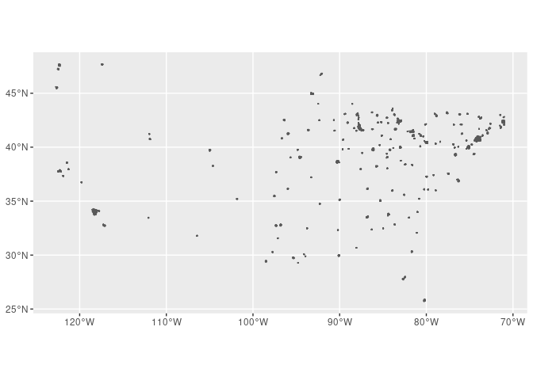

Spatial Exploration
================
austin
10/14/2020

``` r
library(tidyverse)
```

    ## ── Attaching packages ───────────────────────────────────────────────────── tidyverse 1.3.0 ──

    ## ✓ ggplot2 3.3.2     ✓ purrr   0.3.4
    ## ✓ tibble  3.0.3     ✓ dplyr   1.0.2
    ## ✓ tidyr   1.1.2     ✓ stringr 1.4.0
    ## ✓ readr   1.4.0     ✓ forcats 0.5.0

    ## ── Conflicts ──────────────────────────────────────────────────────── tidyverse_conflicts() ──
    ## x dplyr::filter() masks stats::filter()
    ## x dplyr::lag()    masks stats::lag()

``` r
library(sf)
```

    ## Linking to GEOS 3.8.0, GDAL 3.0.4, PROJ 6.3.1

mapping inequality

``` r
tmp <- tempfile()
download.file("https://dsl.richmond.edu/panorama/redlining/static/fullshpfile.zip", tmp)
unzip(tmp)
```

download state data

``` r
tmp <- tempfile()
download.file("https://data.ca.gov/dataset/e212e397-1277-4df3-8c22-40721b095f33/resource/b0007416-a325-4777-9295-368ea6b710e6/download/ca-county-boundaries.zip", tmp) 
unzip(tmp)
```

read in redlining
    data

``` r
holc <- st_read("fullshpfile/shapefile/holc_ad_data.shp")
```

    ## Reading layer `holc_ad_data' from data source `/home/rstudio/ESPM157 Spatial/spatial exploratory/fullshpfile/shapefile/holc_ad_data.shp' using driver `ESRI Shapefile'
    ## Simple feature collection with 8878 features and 7 fields (with 3 geometries empty)
    ## geometry type:  MULTIPOLYGON
    ## dimension:      XY
    ## bbox:           xmin: -122.7675 ymin: 25.70537 xmax: -70.9492 ymax: 47.72251
    ## geographic CRS: WGS 84

``` r
holc %>%
  ggplot()+ 
  geom_sf()
```

<!-- -->

``` r
holc %>% 
  st_crs()
```

    ## Coordinate Reference System:
    ##   User input: WGS 84 
    ##   wkt:
    ## GEOGCRS["WGS 84",
    ##     DATUM["World Geodetic System 1984",
    ##         ELLIPSOID["WGS 84",6378137,298.257223563,
    ##             LENGTHUNIT["metre",1]]],
    ##     PRIMEM["Greenwich",0,
    ##         ANGLEUNIT["degree",0.0174532925199433]],
    ##     CS[ellipsoidal,2],
    ##         AXIS["latitude",north,
    ##             ORDER[1],
    ##             ANGLEUNIT["degree",0.0174532925199433]],
    ##         AXIS["longitude",east,
    ##             ORDER[2],
    ##             ANGLEUNIT["degree",0.0174532925199433]],
    ##     ID["EPSG",4326]]
